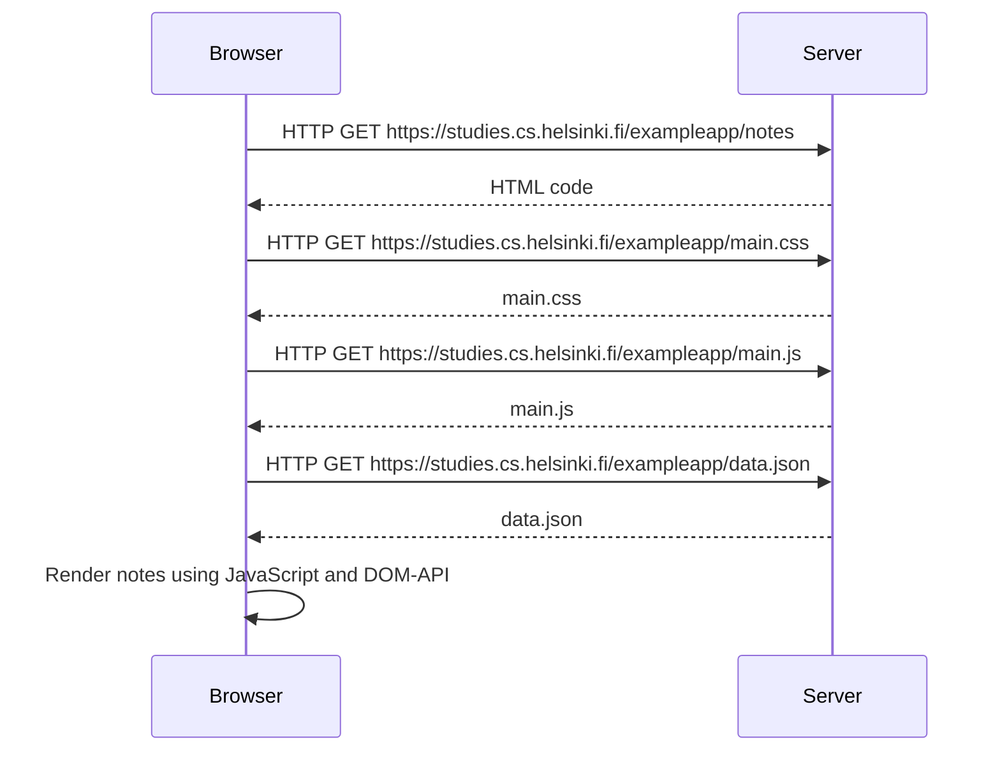

```mermaid

sequenceDiagram
    participant Navegador as Browser
    participant Servidor as Server

    Navegador->>Servidor: HTTP GET https://studies.cs.helsinki.fi/exampleapp/notes
    Servidor-->>Navegador: HTML code
    Navegador->>Servidor: HTTP GET https://studies.cs.helsinki.fi/exampleapp/main.css
    Servidor-->>Navegador: main.css
    Navegador->>Servidor: HTTP GET https://studies.cs.helsinki.fi/exampleapp/main.js
    Servidor-->>Navegador: main.js
    Navegador->>Servidor: HTTP GET https://studies.cs.helsinki.fi/exampleapp/data.json
    Servidor-->>Navegador: data.json
    Navegador->>Navegador: Render notes using JavaScript and DOM-API  

```