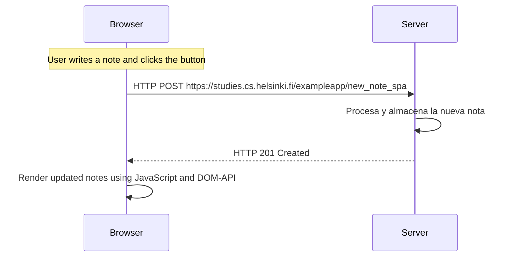

```mermaid

sequenceDiagram
    participant Navegador as Browser
    participant Servidor as Server

    Note over Navegador: User writes a note and clicks the button
    Navegador->>Servidor: HTTP POST https://studies.cs.helsinki.fi/exampleapp/new_note_spa
    Servidor->>Servidor: Procesa y almacena la nueva nota
    Servidor-->>Navegador: HTTP 201 Created
    Navegador->>Navegador: Render updated notes using JavaScript and DOM-API

```